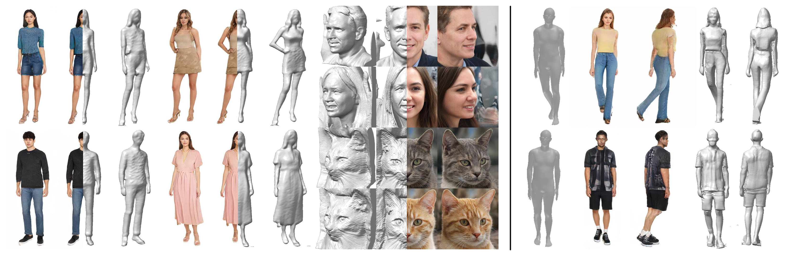

# OP3D

Official PyTorch implementation of the ICCV 2023 paper:

**OrthoPlanes: A Novel Representation for Better 3D-Awareness of GANs** 
Honglin He1,2\*, [Zhuoqian Yang](https://yzhq97.github.io/)1,3\*, Shikai Li1, [Bo Dai](http://daibo.info/)1, [Wayne Wu](https://wywu.github.io/)1†  
1Shanghai AI Laboratory, 2Tsinghua University, 3School of Computer and Communication Sciences, EPFL
 \* equal contribution
 † corresponding author

[[project page](https://orthoplanes.github.io)] [[paper](https://arxiv.org/abs/2309.15830)]

## Updates
- [28/09/2023] Technical report released!
- [13/07/2023] Our work has been accepted by ICCV2023!

## TODO List
- [x] Release technical report.
- [ ] Release code.
- [ ] Release pretrained models.
